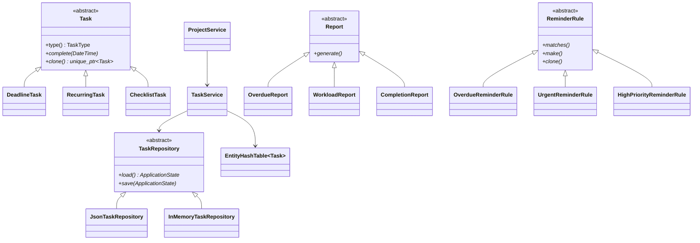

# Deadline Planner на C++20

Deadline Planner — настольное приложение для управления учебными и личными
дедлайнами. Проект создан как итоговая работа по объектно-ориентированному
программированию. Он применяет требования лабораторных работ к полноценной
предметной системе, а не повторяет один учебный вариант.

Приложение умеет:

- создавать обычные, повторяющиеся задачи и чек-листы;
- объединять задачи в проекты;
- показывать срок и цветную шкалу прошедшего времени;
- отмечать задачи и пункты чек-листа выполненными;
- переносить сроки через сервисный слой;
- фильтровать задачи по проекту;
- формировать отчёты по просрочкам, нагрузке и выполнению;
- создавать умные напоминания по полиморфным правилам;
- экспортировать задачи в CSV и Markdown;
- сохранять состояние в JSON и восстанавливать конкретные типы задач;
- запускаться с нативным Windows GUI или консольным интерфейсом.

## Быстрый запуск

Откройте папку проекта:

```text
deadline_planner_cpp
```

Для демонстрации преподавателю дважды щёлкните:

```text
start_demo.bat
```

Скрипт пересоздаёт отдельный файл `data/demo.json`, добавляет два проекта и
шесть задач разных видов, затем открывает графический интерфейс. Обычные
пользовательские данные из `data/planner.json` он не меняет.

Другие команды:

```text
build.bat          сборка всех целей
start_gui.bat      GUI с постоянными пользовательскими данными
start_console.bat  консольная версия
tests.bat          тесты на assert
benchmark.bat      замеры времени и памяти
```

Полная установка на другом компьютере описана в [INSTALL.md](INSTALL.md).

## Где находятся файлы

```text
deadline_planner_cpp/
├── include/deadline/       объявления классов и шаблонная коллекция
│   └── ui/                 интерфейсы консоли и Win32 GUI
├── src/                    реализации классов и точки входа
├── tests/test_main.cpp     модульные и интеграционные assert-тесты
├── tools/benchmark.cpp     контроль времени и рабочего набора памяти
├── data/                   JSON-файлы, создаваемые при запуске
├── exports/                CSV и Markdown после команды «Экспорт»
├── build/                  собранные exe-файлы
├── CMakeLists.txt          описание сборки
└── *.bat                   короткие команды для Windows
```

Главные исполняемые файлы после сборки:

```text
build/bin/deadline_planner_gui.exe
build/bin/deadline_planner_cli.exe
build/bin/deadline_planner_tests.exe
build/bin/deadline_planner_benchmark.exe
```

## Архитектура

Интерфейс зависит от сервисов, сервисы работают с предметными объектами, а
репозиторий отвечает за сохранение. Поэтому одна и та же логика используется
в GUI, консоли и тестах.



### Где показано ООП

**Инкапсуляция.** Поля `Task`, `Project`, `ChecklistItem` и других классов
закрыты. Изменение проходит через методы, которые сохраняют инварианты. Нельзя
создать задачу с пустым названием, неправильным приоритетом или сроком раньше
даты создания.

**Абстракция.** `Task`, `TaskRepository`, `Report`, `ReminderRule` и
`StateExporter` задают контракты. Интерфейс не обязан знать внутреннее
устройство конкретного класса.

**Наследование.** `DeadlineTask`, `RecurringTask` и `ChecklistTask` наследуют
общие данные и операции от `Task`. Конкретные отчёты, правила напоминаний,
экспортёры и репозитории образуют отдельные осмысленные иерархии.

**Динамический полиморфизм.** Вызов `task.complete(now)` через ссылку `Task&`
даёт разное поведение: обычная задача завершается, повторяющаяся переносит
срок, а чек-лист проверяет пункты. Виртуальные деструкторы позволяют безопасно
владеть наследниками через `std::unique_ptr`.

**Статический полиморфизм.** `ReportResult<Row>` и
`EntityHashTable<T>` являются шаблонными классами. Концепт `CloneableEntity`
проверяет требования к типу на этапе компиляции.

**Перегрузка.** `TaskService::addTask` имеет несколько сигнатур. Для
`TimeInterval` перегружены `+`, `+=`, сравнение. У хеш-таблицы перегружены
`[]`, `<<`, `==` и `&&`.

**RAII и правило пяти.** Ресурсы принадлежат объектам. Узлы собственной
таблицы хранятся в `std::unique_ptr`; явных `new` и `delete` нет. Коллекция
реализует глубокое копирование и безопасное перемещение.

## Собственная коллекция

`EntityHashTable<T>` — шаблонная хеш-таблица с раздельными цепочками. Внутри
используется собственный массив корзин и связанные узлы. Она поддерживает:

- добавление и удаление;
- поиск по UUID;
- константный forward-итератор;
- глубокое копирование полиморфных объектов через `clone()`;
- перемещение;
- `operator[]` для доступа;
- `operator<<` для добавления;
- `operator==` для сравнения;
- `operator&&` для пересечения одинаковых объектов.

Эта структура выбрана по смыслу проекта: задачи часто ищутся по уникальному
идентификатору, а средняя сложность поиска близка к `O(1)`.

## Внешняя библиотека

Boost 1.92 используется явно:

- `boost::uuids` создаёт и проверяет UUID;
- `boost::property_tree` кодирует и читает JSON.

STL применяется для строк, умных указателей, алгоритмов, времени, файловой
системы, `vector`, `unordered_map`, `optional` и других стандартных средств.

## Объём и качество

Проект содержит более 5000 строк в файлах `.hpp` и `.cpp`. В это число входят
предметная логика, два интерфейса, тесты и benchmark. Команда подсчёта:

```powershell
$files = Get-ChildItem -Recurse -Include *.hpp,*.cpp |
  Where-Object { $_.FullName -notmatch '\\build\\' }
($files | Get-Content | Measure-Object -Line).Lines
```

Строки исходного кода ограничены 80 символами. Сборка включает предупреждения
`-Wall -Wextra -Wpedantic -Wconversion -Wshadow`. Проверки компилятора и
`static_assert` подтверждают абстрактность базовых классов, виртуальные
деструкторы и `final` у наследников.

Результат текущей проверки:

```text
100% tests passed
1000 задач:
  создание с транзакционным сохранением ≈ 1,0 с
  фильтрация ≈ 0,14 мс
  полиморфный отчёт ≈ 11 мс
  JSON encode/decode ≈ 111 мс
  прирост рабочего набора ≈ 3,5 МиБ
```

Значения benchmark зависят от компьютера, поэтому на защите следует запускать
`benchmark.bat` и показывать фактический результат.

## Материалы для защиты

- [DEMO_10_MIN.md](DEMO_10_MIN.md) — готовый сценарий на десять минут;
- [OOP_QA.md](OOP_QA.md) — ответы про виртуальные и абстрактные классы;
- [CRITERIA_MATRIX.md](CRITERIA_MATRIX.md) — связь критериев с кодом;
- [INSTALL.md](INSTALL.md) — подробная установка и устранение проблем.

Индивидуальную тему и окончательную формулировку задания всё равно должен
подтвердить преподаватель. Проект уже демонстрирует требуемые механизмы, но
формальное решение о соответствии конкретной ведомости принимает он.
